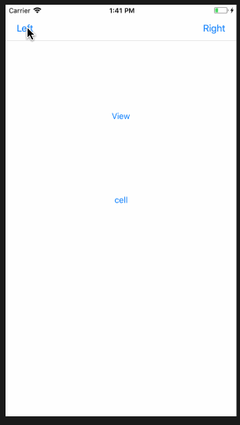

# XYMenu

简易集成弹出菜单 OC&&Swift

三种显示方式(Left, Mid, Right)

自动监测菜单是否超出屏幕(若超出则向上弹出菜单)

若发现问题或者有新的需求想法

请提出Issue或heathhsia@gmail.com



## OC
1. 将XYMenu/XYMenuOC引入工程
2. UIView调用菜单 

	引用 ```UIView+XYMenu.h```头文件
	
	````
	@interface UIView (XYMenu)
	/**
	 UIView Show XYMenu
 	 @param imagesArr 图片
 	 @param titles 标题
	 @param menuType 菜单类型 (XYMenuLeftNormal,XYMenuMidNormal,XYMenuRightNormal)
	 @param block 回调Block
 	*/
 	- (void)xy_showMenuWithImages:(NSArray *)imagesArr titles:(NSArray *)titles menuType:(XYMenuType)menuType withItemClickIndex:(ItemClickIndexBlock)block
	````
	
3. UIBarButtonItem调用菜单

	引用```UIBarButtonItem+XYMenu.h```头文件
	
	````
	@interface UIBarButtonItem (XYMenu)
	/**
	 UIBarButtonItem Show XYMenu
 	 @param imagesArr 图片
	 @param titles 标题
	 @param menuType 菜单类型(XYMenuLeftNavBar,XYMenuRightNavBar)
 	 @param currentNavVC BarButoonItem的当前NavVC
 	 @param block 回调Block
 	*/
	- (void)xy_showMenuWithImages:(NSArray *)imagesArr titles:(NSArray *)titles menuType:(XYMenuType)menuType currentNavVC:(UINavigationController *)currentNavVC withItemClickIndex:(ItemClickIndexBlock)block;
	````

## Swift
1. 将XYMenu/XYMenuSwift引入工程
2. UIView调用菜单
	 
	 ```
	/**
	 UIView Show XYMenu
 	 @param images 图片
	 @param titles 标题
	 @param type 菜单类型 (XYMenuLeftNormal,XYMenuMidNormal,XYMenuRightNormal)
 	 @param closure 回调closure 
 	        index   item索引
 	*/
	sender.xy_showXYMenu(images: images, titles: titles, type: type, closure: { (index) in })
	```
	
3. UIBarButtonItem调用菜单
 
	```
	/**
	 UIBarButtonItem Show XYMenu
 	 @param images 图片
	 @param titles 标题
	 @param type 菜单类型(XYMenuLeftNavBar,XYMenuRightNavBar)
 	 @param currentNavVC BarButoonItem的当前NavVC
 	 @param closure 回调closure 
 	        index   item索引
 	*/
	barButtonItem.xy_showXYMenu(images: images, titles: titles, currentNavVC: self.navigationController!, type: type, closure: { (index) in })
	```

## 版本记录
1.0.1 --- 实现UIView UIBarButtonItem弹出菜单(OC&&Swift)
	 

	
